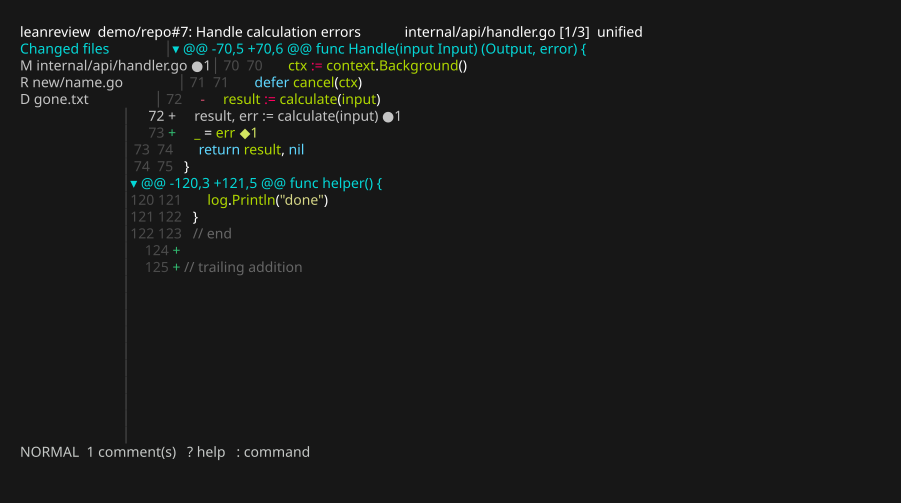
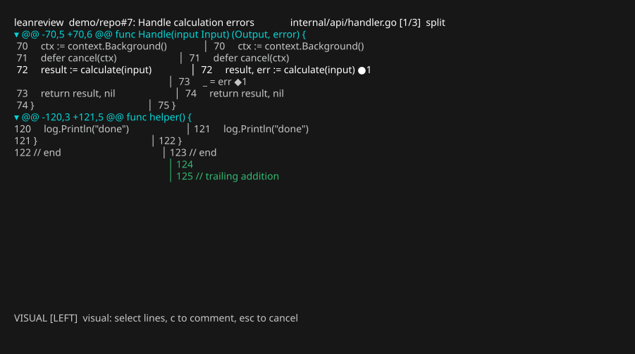
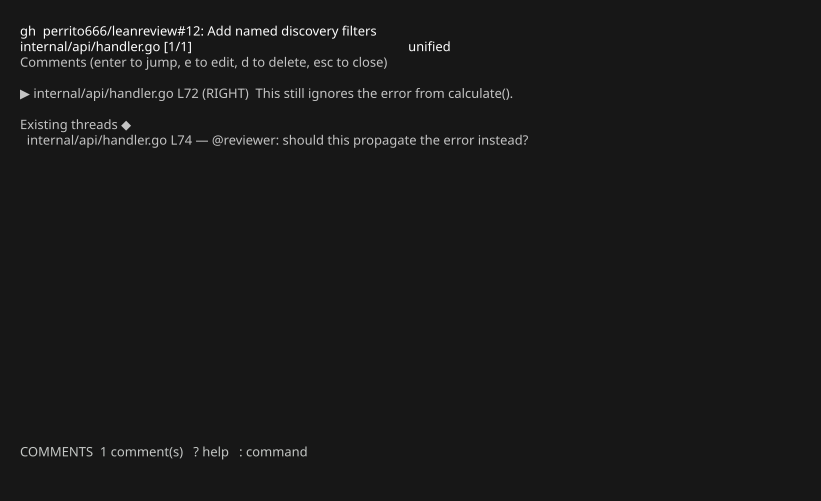

# leanreview

[](https://github.com/perrito666/leanreview/actions/workflows/ci.yml)
[](https://perrito666.github.io/leanreview/)
[](LICENSE)

A terminal code-review client. It reviews a **patch/diff file**, a **local git
comparison**, a **GitHub pull request**, or a **GitLab merge request** in the
same TUI: navigate the diff, attach draft comments anchored to semantic diff
locations, then **export them as Markdown** (great for feeding review notes
back to an AI as prompt feedback) or **submit them as a real review**.

It is a review client, not a git client: the installed `git`, `gh`, and `glab`
handle repository and forge semantics; leanreview owns navigation, rendering,
review state, and comments.

Full documentation — every workflow, concepts, and reference, in English,
Spanish, and French — lives at
**[perrito666.github.io/leanreview](https://perrito666.github.io/leanreview/)**.



*The main view: changed-files sidebar, syntax-highlighted unified diff, a draft
comment (`●1`), and an existing review thread (`◆1`).*

## Install

```bash
go install github.com/perrito666/leanreview/cmd/leanreview@latest
# or, from a checkout:
make            # builds ./leanreview
make install    # installs into GOBIN
```

Other Make targets: `test`, `race`, `vet`, `fmt`, `clean`.

Optional, per mode: [`gh`](https://cli.github.com/) (`gh auth login`) for
GitHub, [`glab`](https://gitlab.com/gitlab-org/cli) (`glab auth login`) for
GitLab. Patch-file and local-git review need nothing but `git`.

## Quick start

```bash
leanreview change.diff        # review a patch file
leanreview --base main        # review this branch against main
leanreview 418                # review PR/MR 418 of this repo's origin
```

## A review session, step by step

This is the core workflow — reviewing an AI-proposed patch and sending the
notes back:

1. **Open the diff.** Any of:

   ```bash
   leanreview change.diff          # a patch file
   git diff | leanreview -         # stdin
   leanreview .                    # working tree vs HEAD
   leanreview --staged             # index vs HEAD
   leanreview --base main          # main...HEAD (merge-base)
   leanreview HEAD~3 HEAD          # explicit revision range
   ```

2. **Navigate.** `j`/`k` move by line, `J`/`K` jump between changes, `]c`/`[c`
   between hunks, `]f`/`[f` between files. `t` toggles unified ↔ split, `\`
   toggles the file sidebar, `za` folds a hunk, `/` searches.

3. **Comment.** Press `c` on a line — or `v` to select a range (`V` grabs the
   whole changed block), then `c`. Your `$EDITOR` opens with a Markdown
   template; write the note, save, quit. The comment is saved as a **draft**:
   the line gets a `●` in the left gutter and the note is previewed inline
   right under it (`i` hides/shows the previews). `e` edits it, `dd` deletes
   it.

   In split view, `h`/`l` choose which side of a paired change you're
   commenting on (the status bar shows `[LEFT]`/`[RIGHT]`):

   

4. **Review your notes.** `C` lists every draft (and, in PR mode, existing
   threads); `Enter` jumps to one, `e` edits, `d` deletes.

   

5. **Export.** `:export notes.md` (or non-interactively,
   `leanreview --export notes.md change.diff`) writes Markdown grouped by
   file — ready to paste back into a prompt:

   ````markdown
   ## internal/api/handler.go

   ### L72 (RIGHT)
   ```go
   result, err := calculate(input)
   ```
   > This still ignores the error from calculate().
   ````

Drafts persist automatically (`:w` forces a save, quitting saves too) and
reload the next time you open the same source. `leanreview --discard <target>`
deletes a saved draft.

## Reviewing with an LLM

leanreview can be the human half of an offline review conversation: an LLM
writes its review into a self-contained `*.review.json`
([exchange format](https://perrito666.github.io/leanreview/reference/exchange-format/)),
you triage it in the TUI (`x` dismisses, `e` edits, `c` adds), and the file
— rewritten in place as you work — goes back to the model as its
instructions. A ready-made agent skill lives in
[`skills/leanreview-loop/`](skills/leanreview-loop/), and
[`editors/`](editors/) ships Vim/Neovim, VS Code, and JetBrains support for
the format. See the
[LLM review loop](https://perrito666.github.io/leanreview/workflows/llm-loop/)
docs.

## Discovering what to review

`--list` finds open requests and lets you pick one:

```bash
leanreview --list                        # your review queue (default engine + filter)
leanreview --list gh "author:alice"      # explicit engine and search filter
leanreview --list "repo:owner/name"      # filter only; engine from config
leanreview --list | cat                  # piped: prints a plain table instead
```

On a terminal the results open a small picker — `Enter` reviews the selected
request immediately, `q` dismisses. Filters are engine-specific: a GitHub
search query for `gh` (default `is:open review-requested:@me`), a REST query
string for `glab` (default `state=opened&reviewer_username=@me`, with `@me`
resolved to your username).

Filters can be **named** in the config and selected with `engine:name` (or
`:name` to keep the default engine); extra arguments refine the named filter:

```bash
leanreview --list :bugs                  # named filter, default engine
leanreview --list gh:bugs                # named filter, explicit engine
leanreview --list :bugs "base:main"      # named filter + extra qualifiers
```

```json
{
  "list_engine": "gh",
  "list_filter": "is:open review-requested:@me",
  "list_filters": {
    "bugs": "is:open label:bug",
    "team": "is:open team-review-requested:mycorp/reviewers"
  }
}
```

`list_filter` remains the fallback used when `--list` gets no filter at all.
A first argument counts as a selector only when it starts with `:` or its
prefix names an engine — so raw qualifiers like `author:x` still work
unquoted as plain filters.

## Reviewing a pull request (GitHub)

```bash
leanreview 418                                   # infers owner/repo from origin
leanreview owner/repo#418
leanreview https://github.com/owner/repo/pull/418
```

leanreview fetches the PR's canonical diff through `gh` (so comment positions
always match what GitHub shows) plus its existing review threads, which appear
as `◆N` markers. On a marked line, `Enter` opens the full thread and `r`
drafts a reply.

When you're done, `s` (or `:comment` / `:approve` / `:request`) opens the
submission screen:


Pick the event with `c`/`a`/`R`, then `y` submits: all draft line comments go
up as **one atomic review**, and staged replies are posted to their threads.
Nothing is ever sent before this confirmation. Enterprise hosts work through
`gh`'s own authentication.

**If the PR head moves between sessions**, saved drafts are re-anchored to the
new diff by matching each comment's captured surrounding context (following
renames) — relocating only on a unique match. Comments that can't be placed
are marked *orphaned*, excluded from submission, and kept for you to
reposition.

## Reviewing a merge request (GitLab)

The same flow works against GitLab through `glab`; the adapter is chosen by
host, so the TUI is identical:

```bash
leanreview 'https://gitlab.com/group/repo/-/merge_requests/42'
leanreview 'group/repo!42'                # nested subgroups work too
leanreview 42                             # inside a checkout with a GitLab origin
```

GitLab has no atomic review-with-comments endpoint, so submission maps onto
its model: each line comment becomes a positioned diff discussion, the summary
becomes a merge-request note, **Approve** approves the MR, and **Request
changes** posts a "Changes requested" note. Comments post in order and a
failure reports how many were already published.

## Reference

### Command line

```text
leanreview [flags] [target]        (the "review" verb is also accepted)
```

| Target | Meaning |
| --- | --- |
| `<file.diff>` / `-` | a patch file / stdin |
| `.` (or nothing) | working tree vs HEAD |
| `<revA> <revB>` | explicit git revision range |
| `418`, `#418`, `!42` | PR/MR number (owner/repo inferred from origin) |
| `owner/repo#418`, `group/repo!42`, full URL | explicit PR/MR reference |

| Flag | Meaning |
| --- | --- |
| `--base <ref>` | compare `<ref>...HEAD` instead of the working tree |
| `--staged` | compare the index against HEAD |
| `-U, --context N` | unified context lines (default 3, configurable) |
| `--export FILE` | write draft comments as Markdown and exit |
| `--discard` | delete the saved draft for this source and exit |
| `--list [engine] [filter]` | discover open PRs/MRs and pick one to review (table when piped) |

### Keys

| Key | Action |
| --- | --- |
| `j` / `k`, `↓` / `↑` | down / up a line (counts work: `3j`) |
| `J` / `K` | next / previous change |
| `]c` / `[c` | next / previous hunk |
| `Tab` / `Shift-Tab`, `]f` / `[f` | next / previous file |
| `gg` / `G` | first / last line |
| `Ctrl-d` / `Ctrl-u` | half page |
| `PgDn` / `PgUp` | full page |
| `h` / `l`, `←` / `→` | scroll long lines (unified) / target side (split) |
| `0` / `$` | scroll to line start / end |
| `t` | toggle unified / split |
| `w` | toggle wrapping of long lines and comment previews |
| `i` | toggle inline comment previews |
| `\` | toggle changed-files sidebar |
| `za` / `zR` / `zM` | fold current hunk / expand all / collapse all |
| `/`, `n`, `N` | search diff text, next / previous match |
| `f` | file picker |
| `C` | comment list |
| `Enter` | open conversation (on a `●` line) / thread (on a `◆` line), else comment list |
| `v` / `V` | select lines / changed block |
| `c` | comment on line or selection (opens `$EDITOR`) |
| `e` | edit draft comment under cursor |
| `x` | dismiss / restore comment under cursor (kept, never submitted) |
| `dd` | delete comment under cursor |
| `p` | PR details: title, description, link (PR mode) |
| `r` | reply to comment under cursor (or its thread in PR mode) |
| `s` | submit review (PR mode) |
| `:w` | save drafts |
| `:export FILE` | export comments (`.json`: review exchange, else Markdown) |
| `:comment` / `:approve` / `:request` | open submission with that event |
| `:q` / `q` | quit |
| `?` | help |

A selection must map onto one continuous range on one side (GitHub
semantics); cross-side selections are rejected before the editor opens.

### The editor

`c`, `e`, and `r` open your editor, resolved in this order: `editor` in the
config file / `LEANREVIEW_EDITOR` → `GIT_EDITOR` → `VISUAL` → `EDITOR` →
`git var GIT_EDITOR` → `vi`. Values are parsed as command lines (`code
--wait`, `nvim -f`). The buffer is a `.md` file with an HTML-comment header
carrying context; the header is stripped automatically — saving an empty body
discards the comment.

### Configuration

Settings resolve in increasing precedence: built-in defaults → config file →
environment → command-line flags. The config file lives at
`$XDG_CONFIG_HOME/leanreview/config.json` (`~/.config/leanreview/config.json`):

```json
{
  "editor": "nvim -f",
  "syntax": true,
  "syntax_style": "github",
  "theme": "default",
  "tab_width": 4,
  "context": 3,
  "keys": { " ": "down", "m": "next-hunk" }
}
```

- `editor` — editor command (parsed as a command line).
- `syntax` / `syntax_style` — enable highlighting and pick a Chroma style. The
  default, `auto`, matches your terminal background (`monokai` on dark,
  `github` on light); any [Chroma style name](https://xyproto.github.io/splash/docs/)
  can be set explicitly.
- `theme` — TUI palette: `default` or `mono`.
- `tab_width` — columns a tab expands to.
- `context` — default unified context lines when `-U` is not passed.
- `keys` — remap normal-mode bindings, `{ "<key>": "<action>" }`. An empty
  action unbinds a key; single keys may bind two-key actions (`next-hunk`,
  `delete-comment`, …). Two-key sequences themselves (`gg`, `]c`, …) and
  numeric counts are fixed.
- `list_engine` / `list_filter` / `list_filters` — defaults for `--list`: the
  discovery engine (`gh` or `glab`), the fallback search filter, and a map of
  named filters selectable as `--list :name` / `--list engine:name`.
- `wrap` / `wrap_width` — wrapping of long diff lines and comment previews
  (default on, `w` toggles). Code wraps hard at the column edge, comments at
  word boundaries; in unified layout the wrap point is
  `min(wrap_width, view)` (default 120), in split layout the side panel's
  width. With wrapping off, long lines clip and `h`/`l` scroll them.

Environment: `LEANREVIEW_EDITOR`, `LEANREVIEW_SYNTAX=0` (disable
highlighting), `NO_COLOR` (disable all color), `LEANREVIEW_LOG` (log path).

### State on disk

- Drafts: `$XDG_STATE_HOME/leanreview/drafts/` (`~/.local/state/…`), one JSON
  file per source, atomic writes.
- Logs: `$XDG_STATE_HOME/leanreview/leanreview.log` — never stdout, which the
  TUI owns.

## Architecture

```
cmd/leanreview      CLI entrypoint, logging, tea.Program wiring
internal/diff       canonical diff model, parser, unified/split projections, Location
internal/source     resolve args -> ReviewSource (patch file, stdin, local git, PR/MR)
internal/git        wrapper over the git executable (incl. origin inference)
internal/forge      host-agnostic Forge seam + PR/MR-ref parsing + host dispatch
internal/forge/ghcli   gh-backed Forge implementation (GitHub)
internal/forge/glabcli glab-backed Forge implementation (GitLab)
internal/review     draft comments, XDG persistence, relocation, Markdown export
internal/editor     $EDITOR resolution/launch, temp file, template stripping
internal/app        Bubble Tea model/update/view, key grammar, selection
internal/ui         theme, syntax highlighting, help text
internal/config     defaults <- config file <- environment
```

The core design rule: rendered screen rows are never canonical comment
locations. Comments anchor to a semantic `diff.Location` (path, side, line
range, surrounding context) that survives resize, folding, unified↔split
toggles — and head-commit changes, via context-based relocation.

## Continuous integration & releases

Two GitHub Actions workflows live in `.github/workflows/`:

- **CI** (`ci.yml`) runs on every pull request and push to `main`: gofmt check,
  `go vet`, build, and `go test -race`.
- **Release** (`release.yml`) runs when a PR is merged to `main`. It bumps the
  version (patch by default; include `#minor` or `#major` in the merge commit
  to bump those instead), cross-compiles binaries for Linux/macOS/Windows
  (amd64 + arm64), and publishes a tagged GitHub Release with checksums and
  auto-generated notes. Include `[skip release]` in the merge commit to skip.

Released binaries report their version via `leanreview --version`.

## License

MIT — see [LICENSE](LICENSE).
