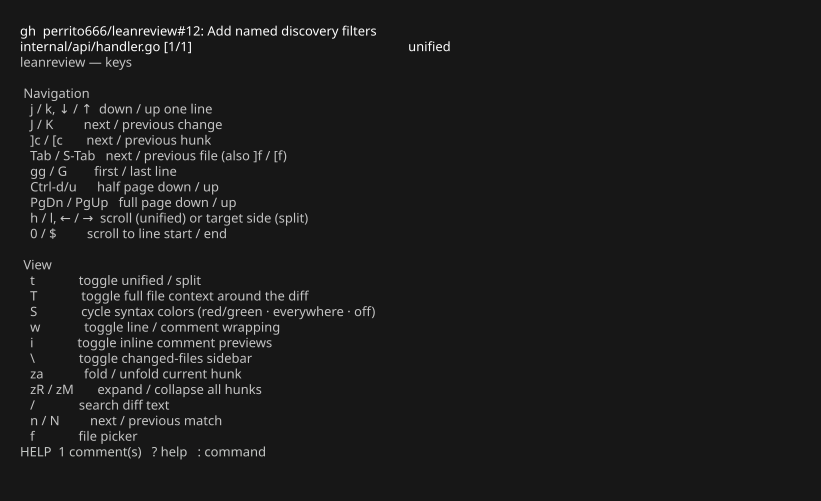

# Touches

Appuyez sur `?` dans la TUI pour afficher cette référence à tout moment.



## Navigation

| Touche | Action |
| --- | --- |
| `j` / `k`, `↓` / `↑` | descendre / monter d'une ligne (les compteurs fonctionnent : `3j`) |
| `J` / `K` | modification suivante / précédente |
| `]c` / `[c` | hunk suivant / précédent |
| `Tab` / `Shift-Tab`, `]f` / `[f` | fichier suivant / précédent |
| `gg` / `G` | première / dernière ligne |
| `Ctrl-d` / `Ctrl-u` | demi-page |
| `PgDn` / `PgUp` | page complète |
| `h` / `l`, `←` / `→` | faire défiler les lignes longues (unifié) / cibler le côté (scindé) |
| `0` / `$` | défiler au début / à la fin de la ligne |

## Affichage

| Touche | Action |
| --- | --- |
| `t` | basculer unifié / scindé |
| `T` | basculer le contexte du fichier complet autour du diff (chargement paresseux, mis en cache ; `]c`/`[c` sautent toujours entre les hunks) |
| `S` | faire défiler la coloration syntaxique : changements en rouge/vert · syntaxe partout (teintée) · désactivée |
| `w` | basculer le retour à la ligne pour les lignes longues et les aperçus de commentaires |
| `i` | basculer les aperçus de commentaires en ligne |
| `\` | basculer la barre latérale des fichiers modifiés |
| `za` / `zR` / `zM` | replier le hunk courant / tout développer / tout replier |
| `/`, `n`, `N` | rechercher dans le texte du diff, correspondance suivante / précédente |
| `f` | sélecteur de fichiers |
| `C` | liste des commentaires |
| `Enter` | ouvrir la conversation (ligne `●` : modifier/supprimer les réponses) / le fil (ligne `◆`), sinon la liste des commentaires |

## Revue

| Touche | Action |
| --- | --- |
| `v` / `V` | sélectionner des lignes / le bloc modifié |
| `c` | commenter la ligne ou la sélection (ouvre `$EDITOR`) |
| `R` | suggérer un changement — l'éditeur s'ouvre avec le code sélectionné dans un bloc ```` ```suggestion ```` ; les forges le rendent applicable |
| `e` | modifier le commentaire en brouillon sous le curseur |
| `x` | rejeter / restaurer le commentaire sous le curseur (conservé, jamais soumis) |
| `r` | répondre au commentaire sous le curseur ([conversations d'échange](exchange-format.md)) ou à son fil (mode PR) |
| `dd` | supprimer le commentaire sous le curseur |

## Mode pull request

| Touche | Action |
| --- | --- |
| `p` (ou `:pr`) | détails de la PR : titre, description, lien |
| `P` | conversation générale : parcourir, répondre, ajouter (les brouillons partent à l'envoi) |
| `s` | soumettre la revue (écran de confirmation) |

## Commandes

| Commande | Action |
| --- | --- |
| `:w` | enregistrer les brouillons |
| `:export FILE` | exporter les commentaires (`.json` : [échange de revue](exchange-format.md), sinon Markdown) |
| `:comment` / `:approve` / `:request` | ouvrir la soumission avec cet événement |
| `:q` / `q` | quitter |

## Remappage

Les liaisons du mode normal à touche unique peuvent être remappées via la
table `keys` dans la [configuration](configuration.md). Une action vide
détache une touche ; des touches uniques peuvent lier des actions à deux
touches (`next-hunk`, `delete-comment`, …).

Les séquences à deux touches (`gg`, `]c`, …) se remappent via la liste
`sequences` — des objets plutôt que des noms concaténés, pour que les
séquences restent exprimables sur toute disposition de clavier :

```json
"sequences": [
  { "keys": [",", "c"], "action": "next-hunk" },
  { "keys": ["d", "d"], "action": "" }
]
```

Une action vide supprime une séquence. `leanreview --check-config` signale
les chevauchements : un préfixe de séquence éclipse une liaison à touche
unique (le préfixe gagne), et les chiffres ne peuvent pas commencer une
liaison — les préfixes de compteur numérique restent fixes.
