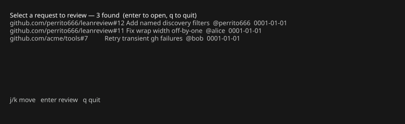

# Discovering what to review

`--list` finds open pull/merge requests and lets you pick one:

```bash
leanreview --list                        # your review queue (default engine + filter)
leanreview --list gh "author:alice"      # explicit engine and search filter
leanreview --list "repo:owner/name"      # filter only; engine from config
leanreview --list | cat                  # piped: prints a plain table instead
```

On a terminal the results open a small picker — `Enter` reviews the selected
request immediately, `q` dismisses:



## Filters

Filters are engine-specific:

- **gh** — a GitHub search query (default:
  `is:open review-requested:@me`). Quoted qualifiers are kept intact, so
  `--list gh 'label:"needs review"'` works as written.
- **glab** — a REST query string (default:
  `state=opened&reviewer_username=@me`, with `@me` resolved to your
  username).

## Named filters

Filters can be **named** in the [configuration](../reference/configuration.md)
and selected with `engine:name` (or `:name` to keep the default engine);
extra arguments refine the named filter:

```bash
leanreview --list :bugs                  # named filter, default engine
leanreview --list gh:bugs                # named filter, explicit engine
leanreview --list :bugs "base:main"      # named filter + extra qualifiers
```

```json
{
  "list_engine": "gh",
  "list_filter": "is:open review-requested:@me",
  "list_filters": {
    "bugs": "is:open label:bug",
    "team": "is:open team-review-requested:mycorp/reviewers"
  }
}
```

`list_filter` remains the fallback used when `--list` gets no filter at all.
A first argument counts as a selector only when it starts with `:` or its
prefix names an engine — raw qualifiers like `author:x` still work unquoted
as plain filters.
