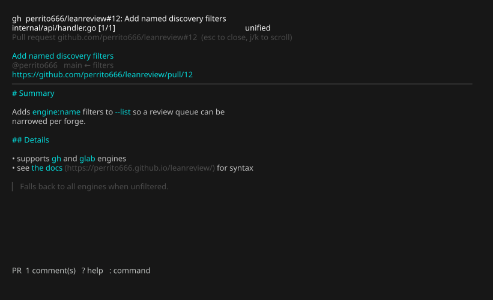
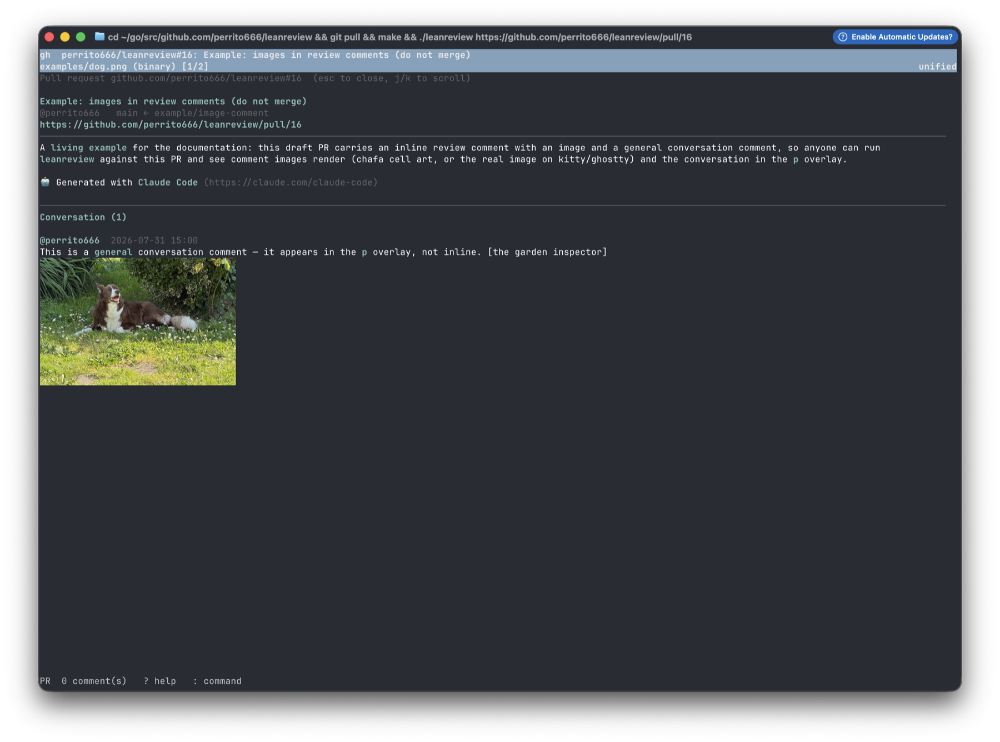
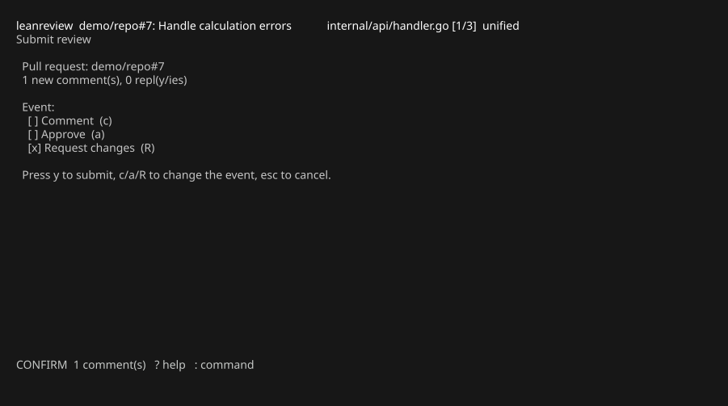

# Reviewing a GitHub pull request

Requires [`gh`](https://cli.github.com/) authenticated with `gh auth login`.
Enterprise hosts work through `gh`'s own authentication.

## Opening a pull request

```bash
leanreview 418                                   # infers owner/repo from origin
leanreview owner/repo#418
leanreview https://github.com/owner/repo/pull/418
```

leanreview fetches the PR's **canonical diff** through `gh` — the exact
representation GitHub anchors review comments to, so positions always match
what GitHub shows — plus the PR metadata and its existing review threads.

The title bar's first line shows a `gh` badge, the PR reference, and its
title.

## The pull-request overlay

Press `p` (or `:pr`) for the pull-request details: title, author, branches,
URL, and the description rendered as styled Markdown. `j`/`k` scroll,
`esc`/`p` closes.



Below the description, the overlay lists the PR's **conversation** — the
general comments that anchor to the request rather than to a line — oldest
first, with authors and timestamps. Images attached to the description or
to conversation comments render right in the overlay.



*A general conversation comment carrying a photo, drawn in the overlay on
ghostty via the kitty graphics protocol.*

## The general conversation

`P` opens the conversation as its own screen: `j`/`k` select a comment,
`r`/`Enter` reply, `a` adds a fresh general comment. Both forges'
conversations are flat, so a reply is a new comment prefilled with a
Markdown quote of what it answers. Everything you write is staged as a
draft — marked *(draft — posts on submit)*, editable with `e` and deletable
with `d` — and posts when you submit the review.

On the submission screen, `g` writes the **review summary** — the general
comment attached to the review itself (the review body on GitHub, the
leading note on GitLab).

## Threads and replies

Existing review threads appear as `◆` markers in the gutter, with the root
comment previewed inline. On a marked line:

- `Enter` opens the full thread (root, replies, resolved/outdated flags).
- `r` drafts a reply in your editor. Replies are staged as drafts and posted
  when you submit.

`C` lists your drafts and, below them, every existing thread.

## Submitting

`s` (or `:comment` / `:approve` / `:request`) opens the submission screen:



Pick the event with `c`/`a`/`R`, then `y` submits. All draft line comments go
up as **one atomic review**; staged replies are posted to their threads
afterwards. Nothing is ever sent before this confirmation.

If a reply fails after the review was created, everything already accepted by
GitHub is cleared from your drafts — retrying submits only what is still
pending, never a duplicate review.

## When the PR head moves

If new commits land between your sessions, saved drafts are re-anchored to
the new diff by matching each comment's captured surrounding context
(following renames), relocating only on a unique match. Comments that cannot
be placed are marked **orphaned**, excluded from submission, and kept for you
to reposition — see [Concepts](../concepts.md).
