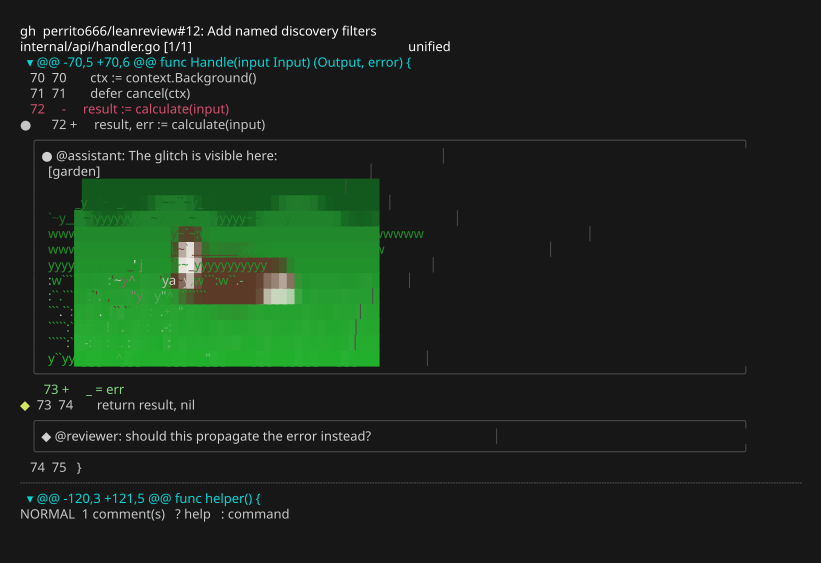

# Revue sans forge

C'est le flux de travail fondamental de leanreview : aucun hôte, aucun
compte, aucun réseau — juste un diff et vos notes. Tout ce que les modes
forge ajoutent (fils de discussion, soumission) vient s'ajouter par-dessus,
donc tout ce qui suit s'applique aussi à ces modes.

## Ouvrir un diff

N'importe laquelle de ces commandes vous place dans la même TUI de revue :

```bash
leanreview change.diff          # a patch file
git diff | leanreview -         # stdin
leanreview .                    # working tree vs HEAD (also: no argument)
leanreview --staged             # index vs HEAD
leanreview --base main          # main...HEAD (merge-base comparison)
leanreview HEAD~3 HEAD          # explicit revision range
```

`-U`/`--context` contrôle le nombre de lignes de contexte unifié (3 par
défaut, configurable).

## Navigation

`j`/`k` déplacent d'une ligne, `J`/`K` sautent entre les modifications,
`]c`/`[c` entre les hunks, et `Tab`/`Shift-Tab` (ou `]f`/`[f`) entre les
fichiers. `t` bascule la disposition unifiée ↔ scindée, `\` bascule la barre
latérale des fichiers modifiés, `za` replie un hunk, `/` recherche dans le
texte du diff.

La barre de titre affiche toujours le titre de la revue sur sa première
ligne, et le fichier courant, la position et la disposition sur la seconde.


*Disposition scindée : les suppressions stylisées sur le panneau de gauche,
les ajouts sur celui de droite, et un commentaire en brouillon encadré
au-dessus du panneau de droite.*

### Contexte du fichier complet

`T` recadre la vue unifiée en fichier complet avec le diff superposé : les
lignes des hunks restent surlignées (et commentables) tandis que les lignes
environnantes se remplissent, et `]c`/`[c` continuent de sauter entre les
hunks avec la vue centrée sur votre ligne. Le contenu n'est récupéré qu'à
la première demande (depuis git — ou depuis la forge en mode PR), mis en
cache sur disque avec une clé d'identité de contenu, et le cache est
nettoyé par âge et taille au démarrage. Dans le fichier complet, chaque hunk est
encadré — un trait discret plus son en-tête `@@` là où il commence, un
trait là où il finit — pour que l'étendue de l'extrait revu reste
évidente. `T` à nouveau revient à la vue diff seul, où un trait discret
marque chaque frontière de hunk.

## Commenter

Appuyez sur `c` sur une ligne — ou `v` pour sélectionner une plage (`V`
capture tout le bloc modifié), puis `c`. Votre `$EDITOR` s'ouvre avec un
modèle Markdown ; rédigez la note, enregistrez, quittez. Le commentaire
devient un **brouillon** : la ligne reçoit un `●` dans la gouttière de
gauche et la note est prévisualisée en ligne dans un encadré bordé
juste en dessous (`i` masque/affiche les aperçus). `e` le modifie, `dd` le
supprime.

En disposition scindée, `h`/`l` choisissent de quel côté d'une modification
appariée vous commentez — la barre d'état affiche `[LEFT]`/`[RIGHT]`.

`R` au contraire **suggère un changement**, à la GitHub : l'éditeur
s'ouvre avec les lignes sélectionnées pré-remplies dans un bloc
```` ```suggestion ```` — modifiez le bloc en votre remplacement proposé.
Les suggestions s'affichent distinctement dans la boîte du fil (une
étiquette plus des lignes de code en vert) et sont soumises comme
suggestions nativement applicables sur GitHub (la forme à plage de GitLab
est produite automatiquement pour les sélections multilignes).

Une sélection doit correspondre à une plage continue sur un seul côté ; les
sélections traversant les deux côtés sont rejetées avant l'ouverture de
l'éditeur.

Tous les commentaires et fils d'une ligne partagent une seule boîte
conteneur, du plus ancien au plus récent, si bien que la discussion se lit
comme un seul fil. Les références d'images Markdown dans les commentaires
sont rendues en ligne — graphiques kitty sur kitty/ghostty, art en
cellules via `chafa` ailleurs (voir le réglage `images` dans la
[configuration](../reference/configuration.md)). En mode PR/MR, les pièces
jointes des commentaires — y compris les balises HTML `` de GitHub —
sont téléchargées via l'authentification de la forge et mises en cache ;
les autres URL distantes restent des étiquettes.


*Une image référencée depuis un commentaire de revue…*



*…et la boîte du fil la rendant en art de cellules via chafa. Sur kitty ou
ghostty, l'image réelle est dessinée à la place, via le protocole graphique
kitty.*

## Relire ses notes

`C` liste chaque brouillon ; `Enter` saute vers l'un d'eux, `e` le modifie,
`d` le supprime.


## Exporter

`:export notes.md` — ou, de façon non interactive, `leanreview --export
notes.md change.diff` — écrit du Markdown groupé par fichier, avec l'extrait
commenté cité au-dessus de chaque note :

````markdown
## internal/api/handler.go

### L72 (RIGHT)
```go
result, err := calculate(input)
```
> This still ignores the error from calculate().
````

Cette sortie est conçue pour être collée directement dans un prompt d'IA en
guise de retour de revue, ou dans un e-mail de revue en texte brut.

## Persistance des brouillons

Les brouillons s'enregistrent automatiquement (`:w` force un enregistrement ;
quitter enregistre aussi) et se rechargent la prochaine fois que vous ouvrez
la **même source** — chaque source possède une clé d'identité stable (voir
[Concepts](../concepts.md)). `leanreview --discard <target>` supprime le
brouillon enregistré pour une source.
